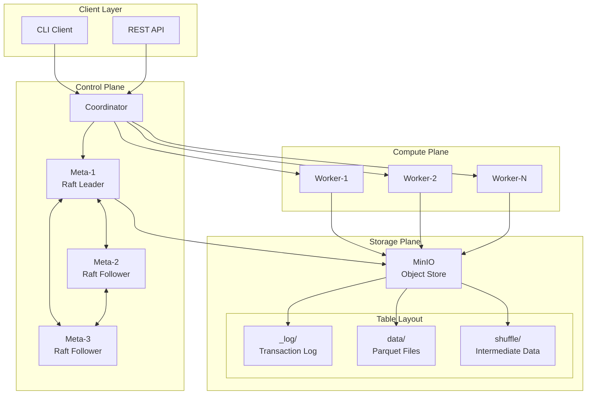
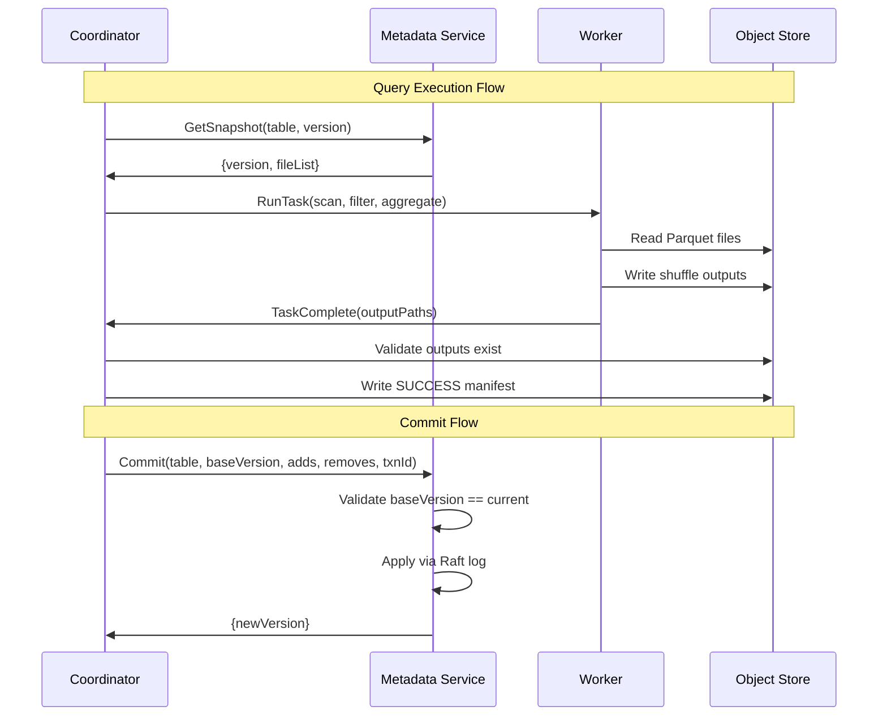

# Mini Lakehouse Design Document

## Overview

The Mini Lakehouse is a distributed data processing system that implements the core patterns of modern lakehouse architectures. It consists of three main planes:

- **Storage Plane**: Transactional data lake using Parquet files and commit logs in object storage
- **Control Plane**: Raft-replicated metadata service providing linearizable consistency
- **Compute Plane**: Distributed query executor with fault-tolerant task scheduling

The system is designed to be minimal yet complete, demonstrating key lakehouse concepts including ACID transactions, distributed query processing, and fault tolerance in a deployable package.

## Architecture



The architecture follows a clear separation of concerns:
- Clients interact only with the Coordinator
- Coordinator manages query planning and task distribution
- Metadata service handles all table state through Raft consensus
- Workers execute tasks and communicate through object storage
- All table state (data + commit logs + shuffle outputs) lives in object storage; Raft persists consensus state on local disk

## Components and Interfaces

### Object Store (MinIO)

**Purpose**: Provides S3-compatible storage for all persistent data

**Storage Layout**:
```
s3://lake/
├── tables/
│   └── <table_name>/
│       ├── _log/
│       │   ├── 00000000000000000001.json
│       │   ├── 00000000000000000002.json
│       │   └── checkpoint_00000000000001000.json (optional, v2)
│       ├── data/
│       │   ├── part-00000-<uuid>.parquet
│       │   └── part-00001-<uuid>.parquet
│       └── _tmp/
│           └── <txn_id>/
│               └── <attempt>/
├── shuffle/
│   └── <job_id>/
│       └── <stage_id>/
│           └── <task_id>/
│               ├── <attempt>/
│               │   └── part-<partition>.parquet
│               └── SUCCESS.json
└── results/
    └── <job_id>/
        └── result.parquet
```

**Key Design Decisions**:
- Transaction log controls visibility, not directory listing
- Temporary files use attempt-scoped paths for safe retries
- Worker writes attempt outputs, reports to coordinator
- **Coordinator validates existence and writes SUCCESS.json manifest**
- Reduce stages read only SUCCESS.json manifests (never list directories)

### Metadata Service

**Purpose**: Raft-replicated service managing table metadata and transaction commits

**gRPC Interface**:
```protobuf
service MetadataService {
  rpc CreateTable(CreateTableRequest) returns (CreateTableResponse);
  rpc GetLatestVersion(GetLatestVersionRequest) returns (GetLatestVersionResponse);
  rpc GetSnapshot(GetSnapshotRequest) returns (GetSnapshotResponse);
  rpc Commit(CommitRequest) returns (CommitResponse);
  rpc ListVersions(ListVersionsRequest) returns (ListVersionsResponse);
  rpc Leader(LeaderRequest) returns (LeaderResponse);
  rpc Health(HealthRequest) returns (HealthResponse);
}

message CommitRequest {
  string table_name = 1;
  uint64 base_version = 2;
  string txn_id = 3;
  repeated FileAdd adds = 4;
  repeated FileRemove removes = 5;
}
```

**Raft State Machine**:
- Tables: `map[tableName] -> {latestVersion, schema, createdAt}`
- Versions: `map[tableName][version] -> LogEntry`
- Transactions: `map[tableName][txnId] -> version` (for idempotency)

**Consistency Guarantees**:
- All reads routed to Raft leader for linearizable consistency
- Commits are serialized through Raft log
- Transaction IDs prevent duplicate commits

### Coordinator

**Purpose**: Query planning, task scheduling, and job management

**Core Responsibilities**:
1. **Query Planning**: Convert SQL-like queries into stage-based DAGs
2. **Task Scheduling**: Assign tasks to workers with load balancing
3. **Failure Handling**: Detect worker failures and retry tasks
4. **Result Management**: Collect and return final query results

**Task Execution Model**:
```
Query -> Stages -> Tasks -> Workers
```

**Stage Types**:
- **Map Stage**: Scan, filter, project, partial aggregate
- **Reduce Stage**: Merge partial aggregates, final results

### Workers

**Purpose**: Execute tasks assigned by coordinator

**gRPC Interfaces**:
```protobuf
// Coordinator service (called by workers)
service CoordinatorService {
  rpc RegisterWorker(RegisterWorkerRequest) returns (RegisterWorkerResponse);
  rpc Heartbeat(HeartbeatRequest) returns (HeartbeatResponse);
  rpc ReportTaskComplete(ReportTaskCompleteRequest) returns (ReportTaskCompleteResponse);
}

// Worker service (called by coordinator)
service WorkerService {
  rpc RunTask(RunTaskRequest) returns (RunTaskResponse);
  rpc CancelTask(CancelTaskRequest) returns (CancelTaskResponse);
}
```

**Task Types Supported**:
- **Scan**: Read Parquet files with optional filters
- **Filter**: Apply WHERE conditions
- **Project**: Select specific columns
- **Aggregate**: GROUP BY with COUNT, SUM operations
- **Shuffle**: Partition data for reduce stage

## Data Models

### Transaction Log Entry

```json
{
  "version": 12,
  "timestamp_ms": 1734567890123,
  "txn_id": "txn_abc123",
  "schema": {
    "fields": [
      {"name": "id", "type": "int64"},
      {"name": "name", "type": "string"},
      {"name": "value", "type": "float64"}
    ]
  },
  "adds": [
    {
      "path": "data/part-00000-uuid.parquet",
      "rows": 12345,
      "size": 999999,
      "partition": {},
      "stats": {
        "min_values": {"id": 1, "value": 0.1},
        "max_values": {"id": 12345, "value": 999.9}
      }
    }
  ],
  "removes": [
    {
      "path": "data/old-part-uuid.parquet"
    }
  ]
}
```

### Task Specification

```json
{
  "job_id": "job_123",
  "stage": 0,
  "task_id": 17,
  "attempt": 1,
  "operation": "MAP_AGG",
  "input_files": [
    "s3://lake/tables/events/data/part-00000.parquet"
  ],
  "filter": "value > 100",
  "group_by": ["category"],
  "aggregates": [
    {"function": "sum", "column": "amount"},
    {"function": "count", "column": "*"}
  ],
  "num_partitions": 32,
  "output_path": "s3://lake/shuffle/job_123/stage_0/task_17/attempt_1/"
}
```

### SUCCESS Manifest

```json
{
  "task_id": 17,
  "attempt": 1,
  "timestamp_ms": 1734567890123,
  "outputs": [
    {
      "partition": 0,
      "path": "part-0.parquet",
      "rows": 1234,
      "size": 56789
    }
  ]
}
```

## Correctness Properties

*A property is a characteristic or behavior that should hold true across all valid executions of a system-essentially, a formal statement about what the system should do. Properties serve as the bridge between human-readable specifications and machine-verifiable correctness guarantees.*

After analyzing the acceptance criteria, the following properties have been identified for property-based testing:

### Storage Plane Properties

**Property 1: Parquet format consistency**
*For any* data written to a table, the output files should be valid Parquet format and stored in the correct object store location
**Validates: Requirements 1.1**

**Property 2: Path structure consistency**
*For any* table and data write operation, the resulting files should follow the consistent path pattern `tables/<table_name>/data/part-<id>-<uuid>.parquet`
**Validates: Requirements 1.2**

**Property 3: Temporary path isolation**
*For any* uncommitted write operation, data files should exist only in temporary paths scoped by transaction and attempt IDs
**Validates: Requirements 1.3**

**Property 4: Log-controlled visibility**
*For any* table snapshot, the visible files should exactly match those specified in the transaction log, regardless of what exists in storage
**Validates: Requirements 1.4, 1.5**

### Transaction Properties

**Property 5: Version increment consistency**
*For any* successful write commit, exactly one new version should be created in the transaction log
**Validates: Requirements 2.1**

**Property 6: Concurrent commit exclusion**
*For any* set of concurrent commit attempts with the same base version, exactly one should succeed and the others should be rejected
**Validates: Requirements 2.2**

**Property 7: Stale version rejection**
*For any* commit request with a base version that is not current, the metadata service should reject it
**Validates: Requirements 2.3**

**Property 8: Snapshot isolation**
*For any* version number, reading the table at that version should return deterministic results regardless of concurrent operations
**Validates: Requirements 2.4**

**Property 9: Log replay determinism**
*For any* sequence of transaction log entries, applying them multiple times should produce identical file lists
**Validates: Requirements 2.5**

**Property 10: Commit idempotency**
*For any* commit request with a transaction ID, retrying it should return the same version without creating duplicate changes
**Validates: Requirements 2.6**

### Metadata Service Properties

**Property 11: Leader-based commit processing**
*For any* commit request, it should be processed by the current Raft leader
**Validates: Requirements 3.2**

**Property 12: Metadata replication**
*For any* table metadata stored, it should be replicated across all Raft nodes
**Validates: Requirements 3.4**

**Property 13: Linearizable read consistency**
*For any* metadata read, it should reflect the latest committed version as determined by the Raft leader
**Validates: Requirements 3.5, 3.6**

### Query Execution Properties

**Property 14: Stage-based planning**
*For any* submitted query, the coordinator should generate an execution plan with clearly defined stages
**Validates: Requirements 4.1**

**Property 15: Operation support completeness**
*For any* query using scan, filter, projection, or aggregation operations, the system should execute it correctly
**Validates: Requirements 4.2**

**Property 16: Object storage shuffle**
*For any* multi-worker query, intermediate data should be exchanged through object storage paths
**Validates: Requirements 4.3**

**Property 17: Result availability**
*For any* completed query, results should be available either as return values or in object storage
**Validates: Requirements 4.4**

**Property 18: GROUP BY correctness**
*For any* GROUP BY query with count and sum aggregates, the results should match expected mathematical outcomes
**Validates: Requirements 4.5**

### Fault Tolerance Properties

**Property 19: Task retry isolation**
*For any* retried task, each attempt should write outputs to separate attempt-scoped paths
**Validates: Requirements 5.3**

**Property 20: SUCCESS manifest authority**
*For any* successfully completed task, the coordinator should create a SUCCESS manifest after validating outputs
**Validates: Requirements 5.4, 5.6**

**Property 21: Canonical output consumption**
*For any* shuffle read operation, only outputs from successful attempts (with SUCCESS manifests) should be consumed
**Validates: Requirements 5.5**

**Property 22: Leader failure retry**
*For any* commit operation during leader failure, the coordinator should retry with the new leader
**Validates: Requirements 6.2**

**Property 23: Duplicate commit detection**
*For any* duplicate commit request, the metadata service should detect it using transaction IDs
**Validates: Requirements 6.3**

**Property 24: State preservation across leader changes**
*For any* leader election, all existing table state and versions should remain intact
**Validates: Requirements 6.4**

**Property 25: Operational continuity**
*For any* leader election completion, normal operations should resume without data loss
**Validates: Requirements 6.5**

### Compaction Properties

**Property 26: Compaction candidate identification**
*For any* set of files below size thresholds, they should be identified as compaction candidates
**Validates: Requirements 7.1**

**Property 27: File consolidation**
*For any* compaction operation, the number of output files should be less than input files, with larger individual sizes
**Validates: Requirements 7.2**

**Property 28: Atomic compaction commits**
*For any* compaction commit, old files should be removed and new files added atomically
**Validates: Requirements 7.3**

**Property 29: Concurrent compaction safety**
*For any* compaction running concurrently with other operations, no data corruption should occur
**Validates: Requirements 7.4**

**Property 30: Query result preservation**
*For any* snapshot version, queries should return identical results before and after compaction
**Validates: Requirements 7.5**

**Property 31: Compaction version validation**
*For any* compaction commit with a stale base version, the metadata service should reject it
**Validates: Requirements 7.6**

### Observability Properties

**Property 32: Trace span hierarchy**
*For any* request processing, OpenTelemetry traces should contain job, stage, and task spans in the correct hierarchy
**Validates: Requirements 8.2**

**Property 33: Structured logging**
*For any* operation, logs should contain structured fields including job IDs, task IDs, and error codes
**Validates: Requirements 8.3**

**Property 34: Raft metrics tracking**
*For any* Raft operation, leader status and apply latency metrics should be recorded
**Validates: Requirements 8.4**

**Property 35: Storage metrics accuracy**
*For any* object store operation, bytes read and written should be accurately measured
**Validates: Requirements 8.5**

## Error Handling

The system implements comprehensive error handling across all components:

### Storage Errors
- **Object Store Failures**: Retry with exponential backoff, fail tasks after max attempts
- **Parquet Read/Write Errors**: Validate file integrity, retry on transient errors
- **Path Resolution Errors**: Validate paths before operations, return clear error messages

### Metadata Service Errors
- **Raft Consensus Failures**: Retry on follower nodes, wait for leader election
- **Version Conflicts**: Return specific error codes for optimistic concurrency failures
- **Schema Validation Errors**: Reject incompatible schema changes with detailed messages

### Query Execution Errors
- **Task Failures**: Retry on different workers, maintain attempt isolation
- **Worker Communication Errors**: Detect via heartbeat timeouts, reassign tasks
- **Resource Exhaustion**: Queue tasks when workers are overloaded

### Network and Infrastructure Errors
- **Network Partitions**: Use Raft's partition tolerance, maintain consistency
- **Container Failures**: Restart failed containers, redistribute workload
- **Storage Unavailability**: Fail fast with clear error messages, retry when available

## Testing Strategy

The testing strategy employs a dual approach combining unit tests for specific scenarios and property-based tests for universal correctness guarantees.

### Property-Based Testing

**Frameworks**: 
- **Go Components**: **Testify** with **gopter** for property-based testing of metadata/coordinator logic
- **Rust Components**: **proptest** for property-based testing of executor/shuffle/parquet handling
- Both configured to run a minimum of 100 iterations per property

**Property Test Requirements**:
- Each property-based test must run at least 100 iterations to ensure statistical coverage
- Tests must be tagged with comments referencing the specific correctness property: `**Feature: mini-lakehouse, Property X: [property text]**`
- Each correctness property must be implemented by exactly one property-based test
- Tests should use smart generators that constrain inputs to valid ranges

**Key Property Categories**:
- **Transaction Properties**: Test commit idempotency, version consistency, concurrent access
- **Storage Properties**: Test file visibility, path consistency, log replay
- **Fault Tolerance Properties**: Test retry behavior, leader election, state preservation
- **Query Properties**: Test result correctness, shuffle behavior, aggregation accuracy

### Unit Testing

**Coverage Areas**:
- Transaction log parsing and application
- Snapshot building from log entries
- Task scheduling and retry logic
- Parquet file operations
- gRPC service implementations

**Integration Testing**:
- End-to-end query workflows
- Concurrent writer scenarios
- Worker failure and recovery
- Leader election during operations
- Compaction with concurrent access

**Chaos Testing**:
- Random container kills during operations
- Network partition injection
- Storage latency simulation
- Resource exhaustion scenarios

### Test Infrastructure

**Docker Compose Test Environment**:
- Isolated test clusters for each test suite
- Configurable failure injection
- Metrics collection for test validation
- Automated cleanup between test runs

**Test Data Generation**:
- Configurable table schemas
- Random data generation with constraints
- Reproducible test scenarios with fixed seeds
- Performance test datasets of various sizes

The testing strategy ensures that both specific edge cases (unit tests) and general correctness properties (property-based tests) are thoroughly validated, providing confidence in system reliability under various conditions.

## Implementation Architecture

### Technology Stack

**Control Plane (Go)**: Coordinator + Metadata Service
- **Raft**: `hashicorp/raft` for consensus and leader election
- **Object Storage**: `minio/minio-go` for S3-compatible operations
- **gRPC**: `grpc/grpc-go` for service communication
- **Property Testing**: `leanovate/gopter` for property-based test generation
- **Metrics**: `prometheus/client_golang` for observability
- **Tracing**: `opentelemetry-go` for distributed tracing

**Data Plane (Rust)**: Workers/Executors
- **Parquet**: `arrow-rs` for high-performance columnar data processing
- **Object Storage**: `aws-sdk-s3` for S3-compatible operations
- **gRPC**: `tonic` for service communication
- **Property Testing**: `proptest` for property-based test generation
- **Metrics**: `prometheus` crate for observability
- **Tracing**: `opentelemetry` crate for distributed tracing

**Shared Interface**: gRPC with versioned Protocol Buffers providing stable cross-language communication

### Service Communication



### Deployment Configuration

**Docker Compose Services**:
```yaml
services:
  minio:
    image: minio/minio
    ports: ["9000:9000", "9001:9001"]
    
  meta-1:
    build: ./cmd/metad
    environment:
      - RAFT_NODE_ID=1
      - RAFT_PEERS=meta-1:8080,meta-2:8080,meta-3:8080
      
  coordinator:
    build: ./cmd/coordinator
    environment:
      - METADATA_ENDPOINTS=meta-1:8080,meta-2:8080,meta-3:8080
      
  worker-1:
    build: ./cmd/worker
    environment:
      - COORDINATOR_ENDPOINT=coordinator:8080
      - WORKER_ID=worker-1
```

### Performance Considerations

**Performance Targets (Future Work)**:
- Focus on correctness and fault tolerance for MVP
- Performance optimization in subsequent iterations
- Benchmarking infrastructure to be added post-MVP

**Scalability Design**:
- Metadata service: 3 nodes for MVP (Raft consensus)
- Workers: Horizontally scalable design
- Tables: Designed for multiple tables per cluster
- Versions per table: Unbounded (checkpointing optional for v1)

**Resource Requirements**:
- Metadata nodes: 2 CPU, 4GB RAM, 10GB storage
- Coordinator: 4 CPU, 8GB RAM
- Workers: 2 CPU, 4GB RAM per worker
- MinIO: 4 CPU, 8GB RAM, 100GB+ storage

## Security Considerations

**Non-goals for MVP**:
- mTLS for inter-service communication (future work)
- Role-based access control (future work)
- Encryption at rest/in transit (future work)

**MVP Security**:
- Basic authentication for object storage
- Network isolation via Docker Compose networking
- Input validation on all gRPC endpoints

## Monitoring and Observability

### Key Metrics

**System Health**:
- `lakehouse_metadata_leader_status` - Current Raft leader
- `lakehouse_worker_heartbeat_last_seen` - Worker health status
- `lakehouse_query_duration_seconds` - Query performance

**Throughput**:
- `lakehouse_commits_total` - Transaction commit rate
- `lakehouse_tasks_completed_total` - Task execution rate
- `lakehouse_bytes_processed_total` - Data processing volume

**Errors**:
- `lakehouse_commit_failures_total` - Transaction failures
- `lakehouse_task_retries_total` - Task retry rate
- `lakehouse_leader_elections_total` - Raft stability

### Alerting Rules

**Critical Alerts**:
- No Raft leader for >30 seconds
- Worker heartbeat missing for >60 seconds
- Commit failure rate >5%
- Object store unavailable

**Warning Alerts**:
- Query latency >1 second
- Task retry rate >10%
- Disk usage >80%
- Memory usage >90%

### Distributed Tracing

**Trace Structure**:
```
Query Execution Trace
├── Query Planning (Coordinator)
├── Metadata Lookup (Metadata Service)
├── Task Scheduling (Coordinator)
└── Task Execution (Workers)
    ├── File Reading (Object Store)
    ├── Data Processing
    └── Output Writing (Object Store)
```

**Trace Attributes**:
- `lakehouse.query.id` - Unique query identifier
- `lakehouse.table.name` - Target table name
- `lakehouse.version` - Snapshot version
- `lakehouse.worker.id` - Executing worker
- `lakehouse.task.attempt` - Task retry attempt

This comprehensive design provides a solid foundation for implementing a production-ready Mini Lakehouse system that demonstrates core lakehouse architecture patterns while maintaining simplicity and reliability.